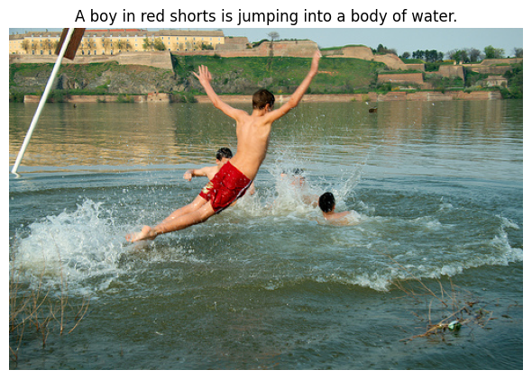

# 深度学习训练营【案例6】：图像自然语言描述生成（让计算机“看图说话”）

相关知识点： RNN、 Attention 机制、 图像和文本数据的处理

## 任务和数据简介

本次案例将使用深度学习技术来完成图像自然语言描述生成任务，输入一张图片，模型会给出关于图片内容的语言描述。本案例使用 Flickr8k 数据集 [1] [2]，包含 8,000 张图片，每张图片有 5 个对应的文本描述。案例使用 Andrej Karpathy 提供的数据集划分方式和图片标注信息 [3]，案例已提供数据处理的脚本，只需下载数据集和划分方式即可。图像自然语言描述生成任务一般采用 Encoder-Decoder 的网络结构， Encoder 采用卷积神经网络 (CNN) 或 Vision Transformer (ViT) 结构，对输入图片进行编码，Decoder 采用 RNN 结构，利用 Encoder 编码信息，逐个单词的解码文字描述输出。模型评估指标采用 BLEU 分数 [4]，用来衡量预测和标签的一致程度。


图1: 本案例中的模型生成的自然语言描述示例

## 方法描述

Encoder 默认使用 ResNet-50 网络作为输入图像的编码器，去除最后 Pooling 和 Fc 两层。编码器已在 ImageNet 上预训练好，在本案例中可以选择对其进行微调以得到更好的结果。图像统一 resize 到 224 × 224 大小。归一化后输入到 encoder 中。

Decoder 使用 RNN 结构，利用 Encoder 编码信息，逐个单词的解码文字描述输出。训练时，语言描述标签信息既要作为目标标签，也要作为 Decoder 的输入（即 teacher forcing 策略）。每一句话以 \<start\> 开始，\<end\> 结束，并且需要统一到相同长度，不足的部分用 \<pad\> 填充。测试时，默认采用 greedy decoding 解码策略，也可以采用 beam search [5] 解码方法来得到更准确的语言描述，具体方法可自行学习。

案例要求实现两种 Decoder 方式，分别对应 Show and Tell [6], Show, Attend and Tell [7]。在此简要阐述两种 Decoder 方法，进一步学习可参考原文章。第一种 Decoder 是用 RNN 结构来进行解码，解码单元可选择 RNN、LSTM、GRU 中的一种，初始的隐藏状态和单元状态可以由编码结果经过一层全连接层后作为解码单元输入得到，后续则采用正常的 RNN 解码。训练时，经过与输入相同步长的解码之后，计算预测和标签之间的交叉熵损失，进行 BP 反传更新参数即可。测试时由于不提供标签信息， 解码单元每一时间步输入单词为上一步解码预测的单词，直到解码出 \<end\> 信息或达到最大解码长度。第二种 Decoder 是用 RNN 加上 Attention 机制来进行解码， Attention 机制做的是生成一组权重，对需要关注的部分给予较高的权重，对不需要关注的部分给予较低的权重。当生成某个特定的单词时， Attention 给出的权重较高的部分会在图像中该单词对应的特定区域，即该单词主要是由这片区域对应的特征生成的。Attention 权重的计算方法为：`alpha = softmax(v * tanh(Wf * features + Wh * hidden)), context = sum(alpha * features)`, 其中 `v, Wf, Wh` 为 3 个线性层，features 为图像特征，hidden 为隐藏状态。初始的隐藏状态和单元状态可以由编码结果经过一层全连接层后作为解码单元输入得到，同时，每一时间步的输入由 Attention 得到的 context 和 word embedding 拼接而成。解码器训练和测试时的流程与第一种 Decoder 描述的一致。

## 参考程序及使用说明

本次案例给出了图像描述生成任务的参考程序，具体使用说明如下：

- `process_dataset.ipynb` 提供了数据集预处理的指导，包括依赖安装、数据组织、脚本执行和结果验证。
- `datasets.py` 定义了 `CaptionDataset` 类，用于加载和处理数据集。
- `models/` 目录包含模型相关代码：
  - `encoder.py`：图像编码器，基于 CNN 提取图像特征。
  - `decoder.py`：文本解码器，支持 RNN 和带注意力机制的 RNN。
  - `attention.py`：注意力机制实现。
- `train.py` 为训练脚本，包含训练和评估功能。
- `captioning.ipynb` 用于评估模型在测试集上的 BLEU 分数，以及可视化模型在测试集部分图片上的生成效果。

## 任务要求

1. 完成代码中的 TODO，运行代码完成模型在 Flickr8k 数据集上的训练，计算验证集上的 BLEU-4 分数。
2. 使用 `captioning.ipynb` 评估模型在测试集上的 BLEU 分数，以及可视化模型在测试集部分图片上的生成效果。
3. (可选) 模型默认采用 greedy decoding 解码策略，即每一步选取概率最高的单词作为输出。另一种解码策略是 beam search，即保存多个候选序列，每一步根据概率选择 top-k 个序列继续扩展，最后选择 BLEU-4 分数最高的序列作为输出。尝试实现 beam search 解码策略，对比 greedy decoding 的效果。
4. 参考程序的超参数可能在本案例数据集上表现不够好。请在参考程序的基础上，综合使用深度学习各项技术，尝试提升该模型在图像描述生成任务上的效果。可从以下方面着手对模型进行提升：
   - 尝试不同的编码器架构（如 ResNet、EfficientNet、Vision Transformer 等）。
   - 尝试不同的解码器架构（如 LSTM、GRU、Transformer 等）。
   - 尝试不同的注意力机制（如 multi-head attention、adaptive attention 等）。
   - 尝试数据增强策略。
   - 尝试不同的超参数（学习率、批量大小、训练轮数等）。
   **如未实现 beam search，则需做出至少 3 项改进，其中至少 1 项不是超参数修改。如实现了 beam search，则仅需做出 1 项改进。**
5. 完成一份案例报告，内容至少包含以下部分：
   - 基础模型的训练结果（包括验证集或测试集 BLEU-4 分数、生成结果示例等）。
   - 如实现了 beam search，则需对比 greedy decoding 和 beam search 解码策略下的 BLEU-4 分数。
   - 所有改进尝试及对应的结果和分析。
   - 模型在测试集上的生成效果展示和分析。

## 注意事项

1. 提交 **所有代码** (*.py,*.ipynb, requirements.txt) 和一份 **pdf / docx / pptx / md / ipynb** 格式的 **案例报告**。
2. **不要提交数据集和模型权重。**
3. 案例报告应详细介绍所有改进尝试及对应的结果，无论是否成功提升模型效果，并对结果作出分析。
4. Notebook 文件注意保存结果。
5. **禁止任何形式的抄袭，借鉴开源程序务必加以说明。**

## 提示

- 本次作业需下载 Flickr8k 数据集和 Karpathy 数据集划分。
- 不需要完成所有 TODO 就可以运行代码。可以先运行一种模型，检查正确后再实现另一种模型。
- 训练过程中可以使用梯度裁剪来防止梯度爆炸。
- 训练时采用 teacher forcing 机制，将真实标签作为下一时间步的输入。
- 损失计算时应忽略填充标记，只计算有效标记的损失。

## 下载数据集

```sh
cd /你的路径/hw6-code
mkdir -p data/flickr8k

kaggle datasets download -d adityajn105/flickr8k -p data/flickr8k --unzip
kaggle datasets download -d shtvkumar/karpathy-splits -p data/flickr8k --unzip
```

## 数据预处理

```sh
jupyter nbconvert --to notebook --execute process_dataset.ipynb --inplace
```

## 参考资料

[1] Flickr8k 数据集 (Kaggle): <https://www.kaggle.com/datasets/adityajn105/flickr8k>

[2] Flickr8k & Flickr30k 数据集 (Github): <https://github.com/awsaf49/flickr-dataset>

[3] 划分方式与 caption 信息：<https://www.kaggle.com/datasets/shtvkumar/karpathy-splits>

[4] BLEU 分数: <https://en.wikipedia.org/wiki/BLEU>

[5] Beam search: <https://en.wikipedia.org/wiki/Beam_search>

[6] Vinyals et al. Show and Tell: A Neural Image Caption Generator. CVPR 2015.

[7] Xu et al. Show, Attend and Tell: Neural Image Caption Generation with Visual Attention. ICML 2015.
